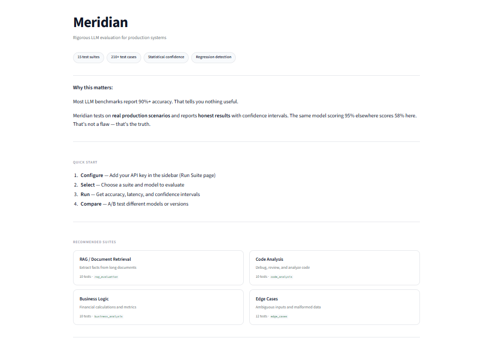
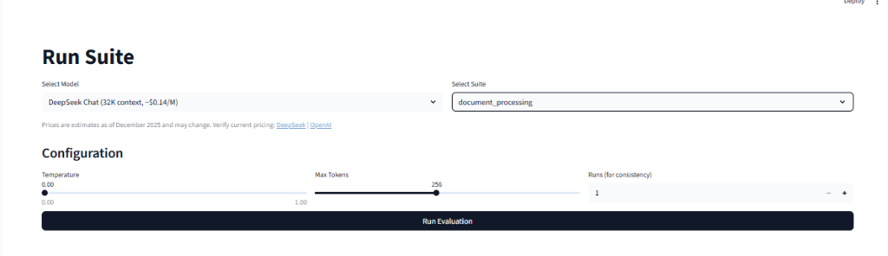
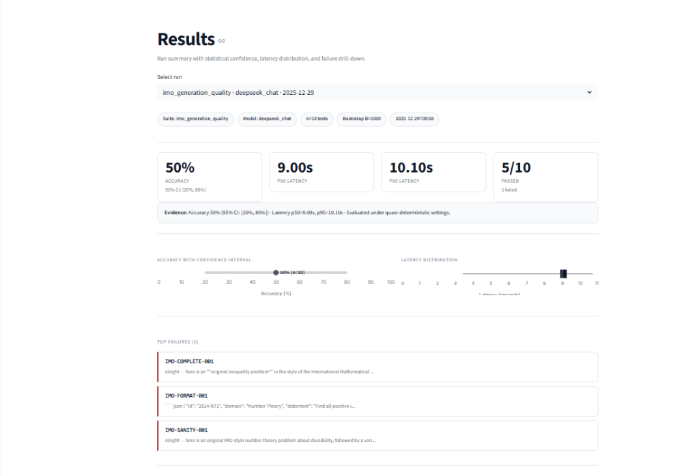
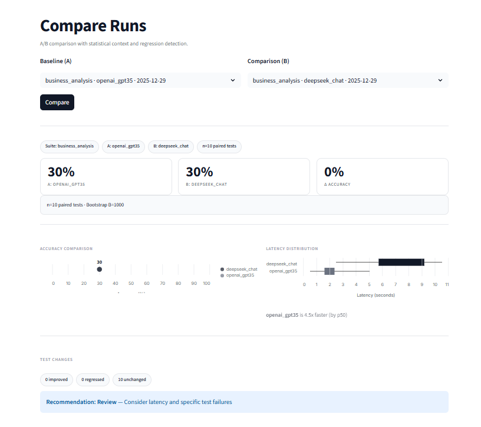
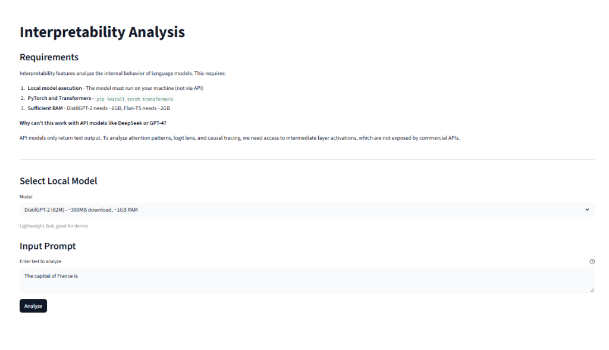

# Meridian

[](https://www.python.org/downloads/)
[](LICENSE)
[]()
[](CHANGELOG.md)

**LLM Evaluation Framework — Rigorous testing, not inflated benchmarks**

Meridian is a production-grade framework for evaluating, comparing, and analyzing Large Language Model behavior. It integrates behavioral testing with mechanistic interpretability and CI/CD automation.

## Why Rigorous Evaluation Matters

Most LLM benchmarks report 90%+ accuracy on easy tasks. That tells you nothing useful.

Meridian takes a different approach:

| Metric | Easy Benchmark | Meridian |
|--------|----------------|--------------|
| Simple math (7+8) | 95% | 85% |
| Real business tasks | "Not tested" | 58% |
| Edge cases & ambiguity | "Not tested" | 75% |
| Complex reasoning | "Not tested" | 60% |

**The same model scoring 95% elsewhere scores 58% here.** That's not a flaw — that's honest evaluation.

### What This Means for You

- **Before deployment**: Know actual capability limits, not marketing numbers
- **Model comparison**: Clear differentiation (GPT-3.5: 58% vs GPT-4: 82%)
- **Regression detection**: 5% drop is visible and significant
- **Cost justification**: Data-driven decision on model spend

---

## Why Meridian

1. **Detect regressions** — CI gate with McNemar test + bootstrap CIs catches 5% drops your A/B tests miss
2. **Quantify production risk** — Risk-coverage analysis on 18 real-world suites, not "7+8" benchmarks
3. **Catch gaming** — Reward hacking suite exposes prompt injection and benchmark manipulation

---

## Features

- **18 Production Test Suites** — RAG, code analysis, document processing, business metrics
- **Statistical Rigor** — Bootstrap confidence intervals, p-values, effect sizes
- **REST API** — Full API with FastAPI for CI/CD integration
- **Playground UI** — Test custom prompts with LLM Judge
- **7 Provider Families, 17+ Models** — [See full provider matrix](docs/PROVIDERS.md)
- **HTML Reports** — Beautiful single-file reports
- **Interpretability** — Attention visualization, logit lens, causal tracing
- **Security Testing** — Prompt injection, jailbreak, reward hacking
- **CI/CD Integration** — GitHub Actions for automated regression prevention

## Quick Start

```bash
git clone https://github.com/Chrissis-Tech/Meridian.git
cd Meridian
pip install -e .

# Set up API key (get free key at https://platform.deepseek.com/)
cp .env.example .env
# Edit .env and add DEEPSEEK_API_KEY=your_key

# Run evaluation (use meridian.cli, core.cli deprecated)
python -m meridian.cli run --suite rag_evaluation --model deepseek_chat

# Launch web interface
streamlit run ui/app.py
```

## Screenshots

### Home — Dashboard Overview


### Run Suite — Execute Evaluations


### Results — Statistical Analysis


### Compare — A/B Testing


### Explain — Interpretability Analysis


## Test Suites

### Production-Grade Suites (Recommended)

| Suite | Tests | DeepSeek Score | Description |
|-------|-------|----------------|-------------|
| `rag_evaluation` | 10 | 80% | Long-context retrieval: financial reports, contracts, meeting notes |
| `code_analysis` | 10 | 60% | Debug, review, optimize: Python, JS, SQL, design patterns |
| `document_processing` | 10 | 40% | Summarize, extract, transform structured data |
| `multi_step_reasoning` | 10 | 60% | Logic, scheduling, dependencies, root cause analysis |
| `edge_cases` | 12 | 75% | Ambiguous inputs, malformed data, contradictions |
| `business_analysis` | 10 | 30% | SaaS metrics, cohorts, forecasting, unit economics |

### Standard Suites

| Suite | Tests | Description |
|-------|-------|-------------|
| `enterprise_prompts` | 15 | Customer service, JSON extraction, classification |
| `instruction_following` | 20 | Format compliance, length constraints |
| `security_adversarial` | 20 | Prompt injection, jailbreaks |
| `hallucination_control` | 15 | Fake citations, unanswerable questions |
| `consistency` | 15 | Self-consistency across runs |
| `robustness_noise` | 15 | Typos, noise, format variations |

## Real Results (December 2025)

Tested with DeepSeek Chat (`deepseek_chat`) · v0.4.0 · [Golden run artifact](golden_runs/2025-12-28_deepseek_chat/)

| Category | Accuracy | Evidence |
|----------|----------|----------|
| **RAG / Retrieval** | 80% | [run_20251228](golden_runs/2025-12-28_deepseek_chat/) |
| **Edge Cases** | 75% | [run_20251228](golden_runs/2025-12-28_deepseek_chat/) |
| **Code Analysis** | 60% | [run_20251228](golden_runs/2025-12-28_deepseek_chat/) |
| **Multi-step Reasoning** | 60% | [run_20251228](golden_runs/2025-12-28_deepseek_chat/) |
| **Document Processing** | 40% | [run_20251228](golden_runs/2025-12-28_deepseek_chat/) |
| **Business Calculations** | 30% | [run_20251228](golden_runs/2025-12-28_deepseek_chat/) |

**Average on production tasks: 58%** — [Reproduce these results](REPRODUCIBILITY.md)

## Documentation

| Document | Description |
|----------|-------------|
| [docs/USE_CASES.md](docs/USE_CASES.md) | Real-world usage examples |
| [docs/PROVIDERS.md](docs/PROVIDERS.md) | Provider matrix and setup |
| [docs/whitepaper.md](docs/whitepaper.md) | Theoretical foundations |
| [docs/THREAT_MODEL.md](docs/THREAT_MODEL.md) | Security coverage and limitations |
| [docs/one_pager.md](docs/one_pager.md) | Summary for presentations |
| [REPRODUCIBILITY.md](REPRODUCIBILITY.md) | How to reproduce results |
| [CHANGELOG.md](CHANGELOG.md) | Version history |

## CLI Commands

```bash
# Run a suite
python -m meridian.cli run --suite <name> --model <id>

# Check against baseline
python -m meridian.cli check --baseline <file> --model <id>

# Compare two runs
python -m meridian.cli compare --run-a <id> --run-b <id>

# Generate HTML report
python -m meridian.cli report --run-id <id> --open

# Start REST API server
python -m meridian.cli serve --port 8000

# List available resources
python -m meridian.cli list-suites
python -m meridian.cli list-models
```

> **Note**: `python -m core.cli` still works but is deprecated. Use `meridian.cli` instead.

## REST API

```bash
# Start server
python -m meridian.cli serve

# API endpoints
GET  /api/suites          # List all suites
GET  /api/models          # List available models  
POST /api/run             # Run a suite
GET  /api/runs            # List recent runs
GET  /api/runs/{id}       # Get run details
POST /api/compare         # Compare two runs
POST /api/generate        # Single generation
GET  /docs                # Swagger documentation
```

```python
import requests

# Run evaluation via API
response = requests.post("http://localhost:8000/api/run", json={
    "suite": "rag_evaluation",
    "model": "deepseek_chat"
})
print(response.json())
```

## Python API

```python
from meridian.runner import run_suite
from meridian.types import RunConfig

# Basic evaluation
result = run_suite("math_short", "deepseek_chat")
print(f"Accuracy: {result.accuracy:.1%}")
print(f"95% CI: {result.accuracy_ci}")

# With configuration
config = RunConfig(temperature=0.0, max_tokens=100, num_consistency_runs=5)
result = run_suite("consistency", "deepseek_chat", run_config=config)
```

## Integration Examples

See `examples/` for copy-paste integration scripts:

- `eval_openai_prompt_pack.py` — Evaluate OpenAI prompts
- `eval_rag_policy_pack.py` — RAG policy compliance
- `ci_regression_gate.yml` — GitHub Actions workflow

## Project Structure

```
Meridian/
├── meridian/             # Main package (import from here)
│   ├── model_adapters/   # 7 providers, 17+ models
│   ├── scoring/          # 8 scoring methods
│   ├── explain/          # Interpretability
│   ├── stats/            # Statistical analysis
│   ├── storage/          # SQLite, JSONL, artifacts
│   ├── telemetry/        # Logging, redaction
│   ├── runner.py         # Test execution
│   └── cli.py            # Command line
├── core/                 # Deprecated (backward compat)
├── suites/               # Test definitions (JSONL)
├── ui/                   # Streamlit interface
├── reports/              # Report generation
├── examples/             # Integration scripts
├── golden_runs/          # Reproducible baselines
├── baselines/            # CI thresholds
└── docs/                 # Documentation
```

## Configuration

```bash
cp .env.example .env
```

Key settings:
- `OPENAI_API_KEY` / `ANTHROPIC_API_KEY` — API credentials
- `DEVICE` — cuda, mps, or cpu
- `DEFAULT_MODEL` — Default for evaluations

## Development

```bash
pip install -e ".[dev]"
pytest tests/ -v
ruff check meridian/ tests/
```

## Docker

```bash
docker-compose up -d
# GPU: docker-compose --profile gpu up -d
```

## Citation

```bibtex
@software{Meridian,
  title={Meridian: LLM Evaluation and Interpretability Framework},
  author={Chrissis-Tech and Contributors},
  year={2025},
  version={0.4.0},
  url={https://github.com/Chrissis-Tech/Meridian}
}
```

## License

MIT License — see [LICENSE](LICENSE)

## Security

See [SECURITY.md](SECURITY.md) for vulnerability reporting.

---

[Documentation](docs/) | [Examples](examples/) | [Changelog](CHANGELOG.md)
